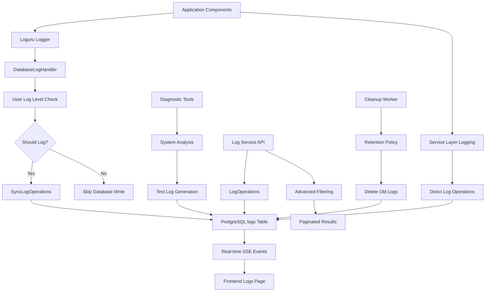

# Timelapser v4 Logging System Architecture

## Overview

The Timelapser v4 logging system is designed as a comprehensive centralized logging infrastructure that aggregates, filters, and monitors log data from all system components in real-time. The system provides complete visibility into application behavior, errors, and system health through a sophisticated multi-source logging pipeline that captures events from the FastAPI backend, Python worker processes, camera operations, and user interactions.

The architecture employs a **database-centric logging approach** that leverages PostgreSQL for persistent log storage, combined with custom loguru integration for seamless application logging. All log entries are stored with comprehensive metadata including log levels, sources, camera associations, timestamps, and structured extra data, enabling powerful filtering, search, and analysis capabilities. The system supports user-configurable log levels that are dynamically applied across all components, ensuring administrators can control log verbosity without application restarts.

**Real-time monitoring** is achieved through SSE (Server-Sent Events) integration, providing live updates to the frontend logs page as new events occur. The system maintains detailed statistics across multiple time periods, tracks log distribution by source and severity, and provides specialized diagnostic tools for troubleshooting system issues. With timezone-aware timestamp handling, comprehensive pagination, advanced search capabilities, and automated cleanup policies, the logging system ensures both operational visibility and performance efficiency in production environments.

## System Flow



See the complete system flow diagram above, which shows both automatic logging (application events) and manual operations (diagnostic tools, cleanup).

## Database Schema

The logging system uses a comprehensive PostgreSQL schema designed for efficient querying, filtering, and analysis:

```sql
-- Core logs table with complete metadata
CREATE TABLE logs (
    id SERIAL PRIMARY KEY,
    level VARCHAR(20) NOT NULL CHECK (level IN ('DEBUG', 'INFO', 'WARNING', 'ERROR', 'CRITICAL')),
    message TEXT NOT NULL,
    timestamp TIMESTAMP WITH TIME ZONE DEFAULT NOW(),
    camera_id INTEGER REFERENCES cameras(id) ON DELETE SET NULL,
    source VARCHAR(100) DEFAULT 'system',
    logger_name VARCHAR(200),
    extra_data JSONB
);

-- Performance indexes for common query patterns
CREATE INDEX idx_logs_timestamp ON logs(timestamp DESC);
CREATE INDEX idx_logs_level ON logs(level);
CREATE INDEX idx_logs_camera_id ON logs(camera_id);
CREATE INDEX idx_logs_source ON logs(source);
CREATE INDEX idx_logs_level_timestamp ON logs(level, timestamp DESC);
CREATE INDEX idx_logs_camera_timestamp ON logs(camera_id, timestamp DESC);

-- JSONB index for extra_data queries
CREATE INDEX idx_logs_extra_data_gin ON logs USING GIN(extra_data);
```

### Schema Design Rationale

**Multi-Source Support**: The `source` field categorizes logs by origin:

- `system`: Application-wide events (startup, configuration, shutdown)
- `api`: HTTP API request/response logging  
- `worker`: Background worker process events
- `camera_X`: Camera-specific events (X = camera ID)
- `diagnostic`: Test logs from diagnostic tools

**Hierarchical Log Levels**: Standard logging levels with database constraint:

- `DEBUG`: Detailed diagnostic information for development
- `INFO`: General operational information
- `WARNING`: Potentially harmful situations  
- `ERROR`: Error events that don't stop application
- `CRITICAL`: Serious errors that may abort operations

**Structured Metadata**:

- `logger_name`: Identifies the specific logger instance
- `extra_data`: JSONB field for structured additional context
- `camera_id`: Optional association with specific cameras
- `timestamp`: Timezone-aware timestamps for accurate timeline reconstruction

**Performance Optimization**:

- Composite indexes for common filter combinations
- GIN index on JSONB data for flexible querying
- Descending timestamp index for recent log retrieval

## Service Architecture

The logging system follows a composition-based service architecture with clear separation of concerns:

### Database Operations Layer

```python
# Async operations for web requests
class LogOperations:
    def __init__(self, db: AsyncDatabase):
        self.db = db
    
    async def get_logs(self, filters...) -> Dict[str, Any]
    async def get_log_summary(self, hours: int) -> LogSummaryModel
    async def add_log_entry(self, level, message, ...) -> Log
    async def delete_old_logs(self, days: int) -> int

# Sync operations for worker processes  
class SyncLogOperations:
    def __init__(self, db: SyncDatabase):
        self.db = db
        
    def write_log_entry(self, level, message, ...) -> Log
    def get_camera_logs(self, camera_id: int) -> List[Log]
    def cleanup_old_logs(self, days: int) -> int
```

### Business Logic Layer

```python
# Comprehensive log management service
class LogService:
    def __init__(self, db: AsyncDatabase):
        self.log_ops = LogOperations(db)
    
    async def get_logs(self, filtering_params...) -> Dict[str, Any]
    async def aggregate_logs_from_services(self, services: List[str]) -> Dict
    async def manage_log_levels(self, configuration: Dict) -> Dict
    async def maintain_audit_trail(self, action, entity...) -> Dict
    async def provide_debugging_views(self, debug_request: Dict) -> Dict

# Worker-compatible sync service
class SyncLogService:
    def __init__(self, db: SyncDatabase):
        self.log_ops = SyncLogOperations(db)
        
    def write_log_entry(self, level, message, ...) -> Log
    def cleanup_old_logs(self, days: int) -> int
```

### Custom Loguru Integration

```python
class DatabaseLogHandler:
    def __init__(self, sync_db: SyncDatabase):
        self.log_ops = SyncLogOperations(sync_db)
    
    def _get_user_log_level(self) -> str:
        # Cached database lookup for user-configured log level
        
    def _should_log_to_database(self, record_level: str) -> bool:
        # Respects user log level settings
        
    def __call__(self, record) -> None:
        # Custom loguru handler that writes to database
```

### Architecture Benefits

**Composition Over Inheritance**: Services use dependency injection rather than mixin patterns, improving type safety and testability.

**Dual Database Pattern**: Async operations for web requests, sync operations for reliable worker processes and logging handlers.

**User-Configurable Filtering**: Log level settings stored in database and dynamically applied to all logging operations.

**Structured Validation**: Pydantic models ensure data consistency across all logging operations.

## Frontend Integration

The frontend provides a comprehensive logs management interface with real-time monitoring capabilities:

### Logs Page Features

```typescript
// Real-time log statistics with skeleton loading
const StatCard = ({ icon, count, label, colorClass, isLoading }) => (
  <div className="p-6 bg-gray-800 border border-gray-700 rounded-lg">
    {isLoading ? (
      <SkeletonLoader />
    ) : (
      <LogStatistics count={count} label={label} />
    )}
  </div>
)

// Advanced filtering capabilities
const filters = {
  search: string,        // Text search in messages
  level: LogLevel,       // Filter by log level
  source: string,        // Filter by log source
  camera: number,        // Filter by camera ID
  dateRange: [Date, Date] // Time-based filtering
}
```

### Key Frontend Components

**Real-time Statistics Dashboard**:

- Error, Warning, Info, Debug, and Total log counts
- Live updates via SSE integration
- Skeleton loading states during data fetching
- Color-coded visual indicators for different log levels

**Advanced Filtering System**:

- Text search across log messages and logger names
- Multi-criteria filtering (level, source, camera, date range)
- Clear filters functionality with active filter indicators
- Persistent filter state during session

**Responsive Log Display**:

- Paginated log table with timezone-aware timestamps
- Source icons (📹 for cameras, ⚙️ for system)
- Color-coded log levels with proper accessibility
- Camera name resolution from database joins

**Administrative Operations**:

- Clear all logs functionality with confirmation dialog
- Refresh capabilities for manual updates
- Export functionality (planned feature)

### SSE Integration

```typescript
// Automatic log updates via centralized SSE
useEffect(() => {
  const handleLogEvent = (event) => {
    if (event.type === 'log_entry_created') {
      fetchStats()  // Refresh statistics
      if (isOnCurrentPage(event.data)) {
        fetchLogs()  // Refresh current page if relevant
      }
    }
  }
  
  useSSESubscription('log_entry_created', handleLogEvent)
}, [])
```

## Diagnostic System Architecture

The logging system includes comprehensive diagnostic tools for troubleshooting and system verification:

### Core Diagnostic Scripts

#### System Analysis Tool (`diagnose_logs.py`)

```python
async def diagnose_log_system():
    """Comprehensive log system diagnostics including:
    - Current log data analysis and statistics
    - Log level distribution verification
    - Camera configuration validation  
    - Test log generation across all levels
    - Before/after comparison analysis
    """
    
    # Analyze current state
    summary = await log_ops.get_log_summary(hours=24)
    
    # Test log generation
    test_levels = ['DEBUG', 'INFO', 'WARNING', 'ERROR', 'CRITICAL']
    for level in test_levels:
        sync_log_ops.write_log_entry(level, f"Test {level} message", "diagnostic")
    
    # Compare results
    new_summary = await log_ops.get_log_summary(hours=1)
```

#### Test Scenario Generator (`test_log_scenarios.py`)

```python
def generate_diverse_log_scenarios():
    """Generates realistic log scenarios including:
    - System-level logs (startup, configuration, errors)
    - Camera-specific logs with proper camera_id association
    - Worker-style logs with background process context
    - API-style logs with request/response patterns
    """
    
    scenarios = [
        ('system', generate_system_logs),
        ('worker', generate_worker_logs), 
        ('api', generate_api_logs),
        ('camera', generate_camera_logs)
    ]
```

### Diagnostic Capabilities

**System State Analysis**:

- Log count distribution across all levels
- Source categorization and coverage analysis
- Camera association verification
- Time range analysis with gap detection

**Test Data Generation**:

- Diverse log level generation for testing filtering
- Camera-specific log creation for association testing
- Source variety generation for comprehensive coverage
- Realistic message patterns for search testing

**Before/After Comparison**:

- Statistical analysis of diagnostic impact
- Verification of log insertion functionality
- Coverage gap identification
- System health assessment

### Usage Patterns

```bash
# Quick system health check
cd backend && python diagnose_logs.py

# Generate comprehensive test data
cd backend && python test_log_scenarios.py

# Expected output analysis
✅ Total logs: 847 (up from 692)
✅ All log levels present: DEBUG(15), INFO(723), WARNING(8), ERROR(1) 
✅ Camera logs: 156 camera-specific entries
✅ Sources: system, worker, api, camera_1, camera_2, diagnostic
```

## Log Management API Endpoints

The logging system exposes comprehensive REST API endpoints for log retrieval, management, and analysis:

### Core Log Retrieval

#### Comprehensive Log Query

```http
GET /api/logs?level=ERROR&camera_id=1&search=connection&page=1&limit=50
```

```json
{
  "success": true,
  "message": "Logs fetched successfully",
  "data": {
    "logs": [
      {
        "id": 1234,
        "level": "ERROR", 
        "message": "Camera connection timeout after 30 seconds",
        "timestamp": "2025-01-01T12:30:00Z",
        "camera_id": 1,
        "camera_name": "Front Door Camera",
        "source": "camera_1",
        "logger_name": "camera_worker",
        "extra_data": {
          "retry_count": 3,
          "timeout_duration": 30
        }
      }
    ],
    "pagination": {
      "page": 1,
      "limit": 50,
      "total_pages": 3,
      "total_items": 127,
      "has_next": true,
      "has_previous": false
    },
    "filters_applied": {
      "level": "ERROR",
      "camera_id": 1,
      "search": "connection"
    }
  }
}
```

#### Log Statistics and Summary

```http
GET /api/logs/stats?hours=24
```

```json
{
  "success": true,
  "message": "Log statistics fetched successfully", 
  "data": {
    "summary": {
      "total_logs": 1547,
      "critical_count": 2,
      "error_count": 23,
      "warning_count": 45,
      "info_count": 1456,
      "debug_count": 21,
      "unique_sources": 7,
      "unique_cameras": 4,
      "first_log_at": "2025-01-01T00:00:15Z",
      "last_log_at": "2025-01-01T23:59:47Z"
    },
    "period_hours": 24,
    "metadata": {
      "generated_at": "2025-01-02T00:00:00Z",
      "data_range": {
        "first_log": "2025-01-01T00:00:15Z",
        "last_log": "2025-01-01T23:59:47Z"
      },
      "coverage": {
        "unique_sources": 7,
        "unique_cameras": 4
      }
    }
  }
}
```

### Log Source Management

#### Available Log Sources

```http
GET /api/logs/sources
```

```json
{
  "success": true,
  "message": "Log sources fetched successfully",
  "data": {
    "sources": [
      {
        "source": "system",
        "log_count": 156,
        "last_log_at": "2025-01-01T23:45:12Z",
        "error_count": 2,
        "warning_count": 8
      },
      {
        "source": "camera_1", 
        "log_count": 334,
        "last_log_at": "2025-01-01T23:59:47Z",
        "error_count": 12,
        "warning_count": 3
      },
      {
        "source": "worker",
        "log_count": 892,
        "last_log_at": "2025-01-01T23:58:33Z", 
        "error_count": 7,
        "warning_count": 28
      }
    ],
    "total_sources": 7
  }
}
```

### Search and Filtering

#### Advanced Log Search

```http
GET /api/logs/search?query=timeout&camera_id=1&level=ERROR&page=1&limit=20
```

```json
{
  "success": true,
  "message": "Log search completed successfully",
  "data": {
    "logs": [
      {
        "id": 1234,
        "level": "ERROR",
        "message": "RTSP connection timeout for camera_1", 
        "timestamp": "2025-01-01T15:30:22Z",
        "camera_id": 1,
        "source": "camera_1"
      }
    ],
    "search_query": "timeout",
    "pagination": {
      "page": 1,
      "limit": 20,
      "total_pages": 2,
      "total_items": 23
    },
    "filters_applied": {
      "camera_id": 1,
      "level": "ERROR"
    }
  }
}
```

### Administrative Operations

#### Log Cleanup Management

```http
DELETE /api/logs/cleanup?days_to_keep=30
```

```json
{
  "success": true,
  "message": "Cleaned up 1,247 old log entries",
  "data": {
    "deleted_count": 1247,
    "days_kept": 30
  }
}
```

#### Clear All Logs (Emergency)

```http
DELETE /api/logs/cleanup?days_to_keep=0
```

```json
{
  "success": true,
  "message": "Cleaned up 5,432 old log entries", 
  "data": {
    "deleted_count": 5432,
    "days_kept": 0
  }
}
```

### Camera-Specific Operations

#### Camera Log Retrieval

```http
GET /api/logs/cameras/1?limit=100
```

```json
{
  "success": true,
  "message": "Camera logs fetched successfully",
  "data": {
    "logs": [
      {
        "id": 2341,
        "level": "INFO",
        "message": "Image captured successfully",
        "timestamp": "2025-01-01T23:55:00Z",
        "camera_id": 1,
        "source": "camera_1"
      }
    ],
    "camera_id": 1,
    "count": 78
  }
}
```

### Error Handling

#### Standard Error Responses

```json
// Invalid log level
{
  "success": false,
  "message": "Invalid log level. Must be one of: DEBUG, INFO, WARNING, ERROR, CRITICAL",
  "status_code": 400
}

// Invalid date format
{
  "success": false, 
  "message": "Invalid start_date format. Use ISO format.",
  "status_code": 400
}

// Camera not found
{
  "success": false,
  "message": "Camera with ID 999 not found", 
  "status_code": 404
}
```

## Integration Points

### SSE Real-time Events

The logging system integrates with the centralized SSE architecture for real-time log monitoring:

```python
# Service layer SSE event broadcasting
async def create_log_entry_event(log: Log):
    await sse_ops.create_event(
        event_type="log_entry_created",
        data={
            "log_id": log.id,
            "level": log.level,
            "source": log.source,
            "camera_id": log.camera_id,
            "message": log.message[:100],  # Truncated for performance
            "timestamp": log.timestamp.isoformat()
        },
        priority="normal",
        source="logging_system"
    )
```

### Loguru Integration Architecture

```python
# Custom database handler setup
def setup_database_logging(sync_db: SyncDatabase):
    """Configures loguru to write to database with user settings."""
    db_handler = DatabaseLogHandler(sync_db)
    logger.add(
        db_handler,
        level="DEBUG",  # Handler decides what to log based on user settings
        format="{time} | {level} | {name}:{function}:{line} - {message}"
    )

# Usage in application components
from loguru import logger

# Automatic database logging with extra context
logger.bind(camera_id=1).error("RTSP connection failed", extra={
    "retry_count": 3,
    "timeout_duration": 30,
    "rtsp_url": "rtsp://192.168.1.100/stream"
})
```

### User Settings Integration

```python
# Dynamic log level configuration 
class DatabaseLogHandler:
    def _get_user_log_level(self) -> str:
        """Cached lookup of user-configured log level from settings table."""
        # 30-second cache to avoid excessive database queries
        
    def _should_log_to_database(self, record_level: str) -> bool:
        """Hierarchical log level checking against user preference."""
        user_level = self._get_user_log_level()
        return level_values[record_level] >= level_values[user_level]
```

### Timezone Awareness

```python
# Consistent timezone handling across all log operations
from ..utils.timezone_utils import get_timezone_aware_timestamp_async

async def create_log_with_timezone(self, log_data):
    """All log timestamps use configured timezone from settings."""
    timestamp = await get_timezone_aware_timestamp_async(self.db)
    return await self.log_ops.add_log_entry(
        level=log_data.level,
        message=log_data.message,
        timestamp=timestamp
    )
```

### Performance Optimizations

**Database Query Optimization**:

- Composite indexes for common filter combinations
- Pagination with limit/offset to prevent memory issues  
- Selective field retrieval for large log volumes
- Connection pooling for concurrent log operations

**Caching Strategies**:

- User log level settings cached for 30 seconds
- Log statistics cached with short TTL (2-5 minutes)
- Log sources cached with longer TTL (15-30 minutes)

**Memory Management**:

- Automatic log rotation and cleanup based on retention policies
- Streaming responses for large log exports
- JSONB compression for extra_data storage

### Security Considerations

**Input Sanitization**:

```python
def _sanitize_string_input(self, input_value: str, max_length: int = 1000) -> str:
    """Prevents injection attacks and limits field length."""
    sanitized = input_value.replace("<", "").replace(">", "")
    return sanitized[:max_length].strip()
```

**Access Control**:

- Log access restricted to authenticated administrators
- Camera-specific logs respect camera access permissions
- Sensitive data filtering in log messages
- Rate limiting on log query endpoints

**Data Privacy**:

- Optional log message truncation for sensitive operations
- RTSP URL masking in connection error logs  
- User action logging for audit trail compliance
- Configurable log retention policies

This comprehensive logging system architecture provides complete visibility into Timelapser v4 operations while maintaining performance, security, and usability standards essential for production deployment.
