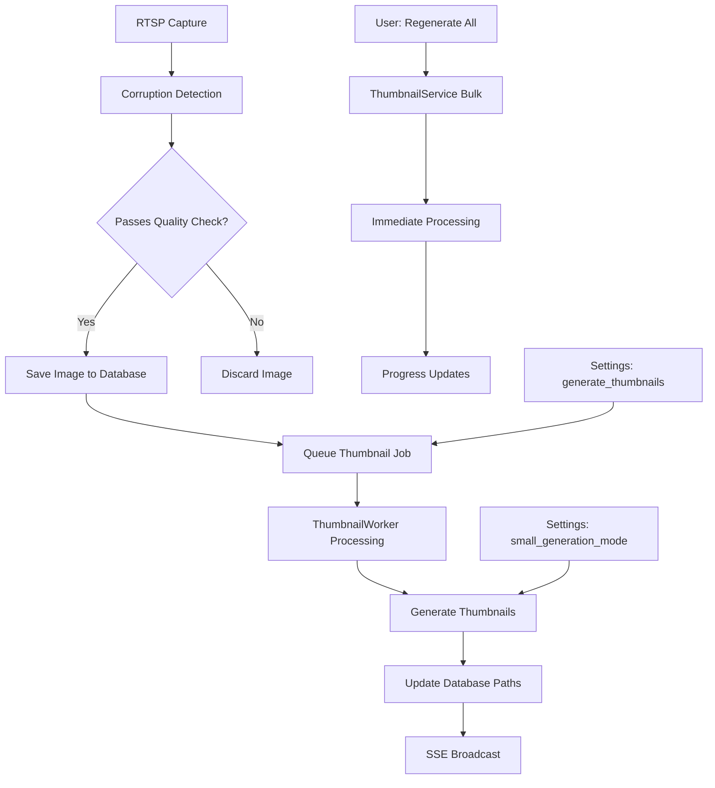

# Timelapser v4 Thumbnail System Architecture

## Overview

The Timelapser v4 thumbnail system is designed as a comprehensive background
processing pipeline that generates optimized image variants (200×150 thumbnails
and 800×600 small images) to dramatically improve dashboard loading performance
and user experience. The system employs a **separate background job
architecture** that decouples thumbnail generation from the critical RTSP image
capture pipeline, ensuring that thumbnail processing never impacts capture
timing or reliability.

When images are successfully captured and pass corruption detection, thumbnail
generation jobs are immediately queued with medium priority and processed by
dedicated background workers within 10-30 seconds. This approach leverages the
existing database schema (which already includes `thumbnail_path`, `small_path`,
and size tracking fields), respects user preferences through the global
`generate_thumbnails` setting, and integrates seamlessly with the corruption
detection system to ensure only high-quality images receive thumbnail variants.
The system maintains a sophisticated 4-tier cascading fallback strategy
(thumbnail → small → full → placeholder) to guarantee users always see visual
content, even when thumbnail generation is disabled or fails.

## System Flow



See the complete system flow diagram above, which shows both automatic
processing (RTSP captures) and manual operations (regenerate/delete from
settings UI).

## File Structure

The thumbnail system uses a separate directory structure to isolate different
image variants and enable independent management policies:

```
data/
├── cameras/
│   ├── camera-{id}/                    # Database camera.id
│   │   ├── timelapse-{id}/            # Database timelapse.id
│   │   │   ├── frames/                # Captured images
│   │   │   │   ├── timelapse-{id}_day001_143022.jpg  # ID + Day number + timestamp
│   │   │   │   ├── timelapse-{id}_day001_143522.jpg
│   │   │   │   └── timelapse-{id}_day002_064512.jpg
│   │   │   ├── thumbnails/            # Generated thumbnails
│   │   │   │   ├── timelapse-{id}_thumb_day001_143022.jpg  # 200×150 dashboard optimized
│   │   │   │   ├── timelapse-{id}_thumb_day001_143522.jpg
│   │   │   │   └── timelapse-{id}_thumb_day002_064512.jpg
│   │   │   ├── smalls/                # Generated small images
│   │   │   │   ├── timelapse-{id}_small_day001_143022.jpg  # 800×600 medium quality
│   │   │   │   ├── timelapse-{id}_small_day001_143522.jpg
│   │   │   │   └── timelapse-{id}_small_day002_064512.jpg
│   │   │   └── videos/                # Generated videos
│   │   │       ├── daily_v01.mp4
│   │   │       └── weekly_v02.mp4
│   │   ├── timelapse-{id2}/          # Next timelapse session
│   │   │   ├── frames/
│   │   │   ├── thumbnails/
│   │   │   ├── smalls/
│   │   │   └── videos/
│   │   └── timelapse-{id3}/          # Historical timelapses
│   └── camera-{id2}/
│       └── timelapse-{id}/
```

### Design Rationale

**Entity-Based Organization**: Files are organized by timelapse entity
(`timelapse-{id}`) within each camera directory, following the database
relationship structure where cameras have timelapses, and timelapses have
images.

**Separate Directories**: Thumbnails and small images are stored in completely
separate directory trees from the original images to:

- Prevent FFmpeg from accidentally including thumbnails when scanning
  directories for video generation
- Enable different retention and cleanup policies for each variant
- Support selective backup strategies (e.g., exclude regeneratable thumbnails
  from backups)
- Simplify bulk operations (delete all thumbnails without affecting originals)

**Filename Conventions**:

- Original images: `timelapse-{id}_day{XXX}_{HHMMSS}.jpg`
- Thumbnails: `timelapse-{id}_thumb_day{XXX}_{HHMMSS}.jpg`
- Small images: `timelapse-{id}_small_day{XXX}_{HHMMSS}.jpg`

**Complete Isolation**: Each timelapse is completely self-contained within its
own directory structure, enabling independent management of different recording
sessions and clear boundaries for video generation scope.

## Job Queue Architecture

The thumbnail generation system uses a dedicated job queue to decouple thumbnail
processing from the critical image capture pipeline. This ensures that thumbnail
generation never impacts RTSP capture timing or reliability.

### Database Schema

```sql
CREATE TABLE thumbnail_generation_jobs (
    id SERIAL PRIMARY KEY,
    image_id INTEGER REFERENCES images(id) ON DELETE CASCADE,
    priority VARCHAR(20) DEFAULT 'medium',
    status VARCHAR(20) DEFAULT 'pending',
    job_type VARCHAR(20) DEFAULT 'single',
    created_at TIMESTAMP WITH TIME ZONE DEFAULT NOW(),
    started_at TIMESTAMP WITH TIME ZONE,
    completed_at TIMESTAMP WITH TIME ZONE,
    error_message TEXT,
    processing_time_ms INTEGER,
    retry_count INTEGER DEFAULT 0
);

CREATE INDEX idx_thumbnail_jobs_status_priority ON thumbnail_generation_jobs(status, priority, created_at);
CREATE INDEX idx_thumbnail_jobs_image_id ON thumbnail_generation_jobs(image_id);
```

### Priority System

**High Priority**: Manual operations from settings UI

- Regenerate all thumbnails (user-initiated)
- Individual image regeneration requests
- Processed immediately when worker is available

**Medium Priority**: New image captures

- Automatically queued after successful RTSP capture
- Processed within 10-30 seconds depending on queue load
- Balances responsiveness with system stability

**Low Priority**: Bulk background operations

- System maintenance tasks
- Large batch processing jobs
- Processed during low-activity periods

### Job Lifecycle

1. **Pending**: Job created and waiting in queue
2. **Processing**: Worker has picked up the job and is generating thumbnails
3. **Completed**: Thumbnails successfully generated and database updated
4. **Failed**: Generation failed after maximum retry attempts
5. **Cancelled**: Job manually cancelled (for bulk operations)
6. **Retry**: Failed job scheduled for retry with exponential backoff (30s,
   2min, 5min)

### Processing Flow

```python
# Job Creation (immediate, non-blocking)
async def queue_thumbnail_job_after_capture(image_id: int):
    """Called after successful image capture in CaptureWorker"""
    job_id = await thumbnail_job_service.queue_job(image_id, priority='medium')
    return job_id  # Returns immediately, processing happens in background

# Background Worker Processing (ThumbnailWorker)
async def process_thumbnail_jobs():
    """Background processing every 10 seconds"""
    pending_jobs = thumbnail_job_service.get_pending_jobs(batch_size=5)

    for job in pending_jobs:
        # Delegate actual processing to existing ThumbnailService
        result = thumbnail_service.generate_thumbnail_for_image(
            job.image_id, force_regenerate=True
        )

        if result.success:
            await thumbnail_job_service.mark_job_completed(job.id, result)
        else:
            await thumbnail_job_service.mark_job_failed(job.id, result.error)
```

### Error Handling & Retries

- **Maximum 3 retry attempts** for failed thumbnail generation
- **Exponential backoff**: 30s, 2min, 5min delays between retries
- **Detailed error logging** with specific failure reasons
- **Automatic cleanup** of failed jobs after 24 hours
- **Graceful degradation**: System continues operating even with thumbnail
  failures

### Backend Layer Integration

- backend/app/database/thumbnail_operations.py
- backend/app/workers/thumbnail_worker.py
- backend/app/services/thumbnail_service.py

### Integration Points

- **Worker Process**: Background thumbnail processor runs independently of main
  worker
- **SSE Events**: Job completion broadcasts real-time updates to frontend
- **Settings Integration**: Respects `generate_thumbnails` global setting
- **Corruption Detection**: Only processes images that passed corruption checks

**Main Worker Orchestrator** (`backend/worker.py`):

```python
# In AsyncTimelapseWorker.__init__()
self.thumbnail_job_service = SyncThumbnailJobService(
    sync_db,
    self.thumbnail_service,
    self.settings_service
)

self.thumbnail_worker = ThumbnailWorker(
    thumbnail_job_service=self.thumbnail_job_service,
    thumbnail_service=self.thumbnail_service,
    sse_ops=self.sse_ops,
)

# In _start_all_workers()
workers = [
    self.capture_worker,
    self.weather_worker,
    self.video_worker,
    self.thumbnail_worker,  # NEW: Add thumbnail processing
    self.scheduler_worker,
    self.cleanup_worker,
]
```

**Capture Worker Integration** (`backend/app/workers/capture_worker.py`):

```python
# In CaptureWorker.__init__()
def __init__(self, ..., thumbnail_job_service: SyncThumbnailJobService):
    self.thumbnail_job_service = thumbnail_job_service

# After successful image capture and corruption detection
async def _after_successful_capture(self, image_record: Image):
    """Called after image saved and corruption checked."""
    try:
        # Queue thumbnail generation job (non-blocking)
        job = self.thumbnail_job_service.queue_job(
            image_record.id,
            priority='medium'
        )
        if job:
            logger.debug(f"Queued thumbnail job {job.id} for image {image_record.id}")
    except Exception as e:
        logger.warning(f"Failed to queue thumbnail job: {e}")
        # Don't fail the capture if thumbnail queuing fails
```

## Entity Ownership Model

The thumbnail system follows a clear hierarchical ownership model that defines
data relationships and cascade behaviors throughout the system.

### Ownership Hierarchy

```
Camera
└── Timelapse
    ├── Image
    │   ├── Thumbnail (200×150)
    │   └── Small (800×600)
    └── Video
```

### Ownership Definitions

**Cameras Own Timelapses**

- Each timelapse belongs to exactly one camera
- Database relationship: `timelapses.camera_id → cameras.id`
- File organization: `data/cameras/camera-{id}/timelapse-{id}/`
- Cascade behavior: Deleting a camera removes all its timelapses

**Timelapses Own Images & Videos**

- Images are captured during specific timelapse recording sessions
- Videos are generated from the images within that timelapse
- Database relationships: `images.timelapse_id → timelapses.id` and
  `videos.timelapse_id → timelapses.id`
- File organization: Images and videos stored within `timelapse-{id}/`
  directories
- Cascade behavior: Deleting a timelapse removes all its images and videos

**Images Own Thumbnails**

- Thumbnails are variants of specific source images, not independent entities
- Database storage: `images.thumbnail_path`, `images.small_path`,
  `images.thumbnail_size`, `images.small_size`
- Job targeting: `thumbnail_generation_jobs.image_id` references the source
  image
- Cascade behavior: Deleting an image automatically removes its thumbnail files
  and database paths

### Backend Settings Integration

New settings added to support job queue configuration:

```python
# System settings
thumbnail_job_batch_size: int = 5           # Jobs processed per batch
thumbnail_worker_interval: int = 10         # Processing interval in seconds
thumbnail_max_retries: int = 3              # Maximum retry attempts
thumbnail_cleanup_hours: int = 24           # Hours to keep completed jobs

# Existing settings respected
generate_thumbnails: bool = True            # Master enable/disable
small_generation_mode: str = "all"          # "none", "latest_only", "all"
purge_smalls_on_completion: bool = False    # Cleanup behavior
```

### Implications for Thumbnail System

**Data Integrity**

- Thumbnail files are automatically cleaned up when source images are deleted
- Database paths are nullified when thumbnails are manually deleted
- Orphaned thumbnail detection can identify files without corresponding image
  records

**Job Queue Design**

- Jobs target individual images (`image_id`) rather than timelapses or cameras
- Each image can have independent thumbnail generation status (pending,
  completed, failed)
- Bulk operations query images within specific timelapses or cameras

**Settings Inheritance**

- Camera-level `generate_thumbnails` setting affects all timelapses on that
  camera
- Timelapse-level settings can override camera defaults (future enhancement)
- Individual images respect the settings active when they were captured

**File Management**

- Thumbnail directories mirror the `camera-{id}/timelapse-{id}` structure
- File cleanup operations can target specific ownership levels (single image,
  entire timelapse, or whole camera)
- Backup and archival strategies can operate at any ownership level

## Thumbnail Cleanup System Architecture

The thumbnail system includes a comprehensive cleanup and maintenance system
designed to keep thumbnail data synchronized with the filesystem and handle
various edge cases that can occur during thumbnail generation and management.

### System Settings

**New Settings Added:**

```sql
-- Cleanup behavior settings
purge_smalls_on_completion BOOLEAN DEFAULT false;  -- Delete smalls when timelapse completes
small_generation_mode VARCHAR(20) DEFAULT 'all';   -- 'none', 'latest_only', 'all'
generate_thumbnails BOOLEAN DEFAULT true;          -- Camera-level setting
```

**Small Generation Modes:**

- **None**: No small images generated (saves 50% disk space)
- **Latest Only**: Only generate small for most recent capture, delete previous
  smalls
- **All**: Generate smalls for every image (current default behavior)

### Database Schema Enhancements

**Timelapse Count Tracking:**

```sql
ALTER TABLE timelapses ADD COLUMN thumbnail_count INTEGER DEFAULT 0;
ALTER TABLE timelapses ADD COLUMN small_count INTEGER DEFAULT 0;

-- Updated in real-time when thumbnails are created/deleted
```

**Real-time Count Updates:**

```python
# When thumbnail generation completes successfully
await db.execute("""
    UPDATE timelapses
    SET thumbnail_count = thumbnail_count + 1,
        small_count = small_count + 1
    WHERE id = %s
""", (timelapse_id,))

# When thumbnails are deleted
await db.execute("""
    UPDATE timelapses
    SET thumbnail_count = thumbnail_count - 1,
        small_count = small_count - 1
    WHERE id = %s
""", (timelapse_id,))
```

### Cleanup Operations

**Manual Cleanup Only** - No scheduled or automatic cleanup operations to
maintain user control and system predictability.

#### 1. Orphaned Files Cleanup

**Problem**: Thumbnail files exist on disk but no database record points to them
**Solution**: App-level "Repair Orphaned Thumbnails" scans filesystem and
matches files back to database records by filename patterns

#### 2. Orphaned Database Records Cleanup

**Problem**: Database has `thumbnail_path` but the actual file is missing
**Solution**: Verification system sets invalid paths to NULL and updates counts

#### 3. Cascade Cleanup

**Problem**: When images/timelapses/cameras are deleted, thumbnail files must be
removed **Solution**: Automatic cleanup triggered by parent entity deletion,
updates counts accordingly

### User Interface Actions

#### Timelapse Modal Actions

- **"Generate Thumbnails"**: Force regenerate all thumbnails for this specific
  timelapse (overwrites existing)
- **"Verify Thumbnails"**: Check file existence for this timelapse only, show
  validity stats

#### App Settings Actions

- **"Verify All Thumbnails"**: System-wide verification across all cameras and
  timelapses
- **"Repair Orphaned Thumbnails"**: Scan entire filesystem for orphaned files
  and match back to database

#### Smart Prompting

When timelapse-level verification detects missing thumbnails, user is prompted:
_"Missing thumbnails detected. Run system-wide repair from Settings?"_

### Verification System

**File Existence Checks:**

- Validates that `thumbnail_path` and `small_path` files actually exist on disk
- Updates database to NULL for invalid paths
- Provides detailed reporting: "47/50 thumbnails valid, 3 missing files"
- Updates `thumbnail_count` and `small_count` to reflect actual state

**Timelapse-Level Verification:**

```python
async def verify_timelapse_thumbnails(timelapse_id: int):
    images = await db.get_timelapse_images(timelapse_id)
    valid_thumbs = 0
    valid_smalls = 0

    for image in images:
        if image.thumbnail_path and file_exists(image.thumbnail_path):
            valid_thumbs += 1
        else:
            await db.clear_thumbnail_path(image.id)

        if image.small_path and file_exists(image.small_path):
            valid_smalls += 1
        else:
            await db.clear_small_path(image.id)

    # Update actual counts
    await db.update_timelapse_counts(timelapse_id, valid_thumbs, valid_smalls)

    return {"valid_thumbs": valid_thumbs, "valid_smalls": valid_smalls, "total_images": len(images)}
```

### Repair System

**App-Level Orphaned File Repair:**

1. Scan all thumbnail and small directories for files
2. Parse filename patterns to extract timelapse_id and timestamp
3. Match orphaned files back to images in database by correlation
4. Update database paths for successfully matched files
5. Delete files that cannot be matched to any image record
6. Update thumbnail_count and small_count for affected timelapses

**No Database Integrity Columns:**

The system does not use `has_valid_thumb` or `has_valid_small` columns to avoid
synchronization issues. Instead, validity is determined by
`thumbnail_path IS NOT NULL` combined with on-demand file existence
verification.

## Thumbnail System API Endpoints

The thumbnail system exposes both serving endpoints for accessing thumbnail
images and management endpoints for cleanup and maintenance operations.

### Image Serving Endpoints

#### Camera-Specific Serving

```
GET /api/cameras/{camera_id}/latest-image/thumbnail    # 200×150 dashboard optimized
GET /api/cameras/{camera_id}/latest-image/small       # 800×600 medium quality
GET /api/cameras/{camera_id}/latest-image/full        # Full resolution
GET /api/cameras/{camera_id}/latest-image             # Metadata with URLs for all variants
```

#### Image-Specific Serving

```
GET /api/images/{image_id}/thumbnail                  # Direct thumbnail access
GET /api/images/{image_id}/small                      # Direct small image access
GET /api/images/{image_id}/serve?size=thumbnail       # Universal serving with size parameter
GET /api/images/batch?ids=1,2,3&size=thumbnail        # Batch thumbnail loading
```

#### Features

- 5-minute caching on camera latest images
- 1-hour caching on individual image thumbnails
- ETag support using `image.id + captured_at` timestamp
- Cascading fallback built into image service
- Proper error handling for missing files

### Management Endpoints

#### System-Level Operations

```
GET  /api/thumbnails/stats                           # System thumbnail statistics
POST /api/thumbnails/regenerate-all                  # Bulk regeneration for all images
GET  /api/thumbnails/regenerate-all/status           # Bulk regeneration progress
POST /api/thumbnails/regenerate-all/cancel           # Cancel bulk regeneration
POST /api/thumbnails/verify                          # Verify all thumbnails system-wide
POST /api/thumbnails/repair                          # Repair orphaned thumbnail files
DELETE /api/thumbnails/cleanup                       # Clean up orphaned files
```

#### Timelapse-Level Operations

```
POST /api/timelapses/{timelapse_id}/thumbnails/generate   # Generate thumbnails for specific timelapse
POST /api/timelapses/{timelapse_id}/thumbnails/verify     # Verify thumbnails for specific timelapse
GET  /api/timelapses/{timelapse_id}/thumbnails/stats      # Get thumbnail counts and status
```

### Request/Response Examples

#### Timelapse Thumbnail Generation

```typescript
POST /api/timelapses/123/thumbnails/generate
{
  "force_regenerate": true,
  "include_smalls": true
}

Response:
{
  "success": true,
  "data": {
    "jobs_queued": 47,
    "estimated_completion": "2025-01-01T12:05:00Z"
  }
}
```

#### Timelapse Verification

```typescript
POST /api/timelapses/123/thumbnails/verify

Response:
{
  "success": true,
  "data": {
    "total_images": 50,
    "valid_thumbnails": 47,
    "valid_smalls": 45,
    "missing_thumbnails": 3,
    "missing_smalls": 5,
    "database_counts": {
      "thumbnail_count": 50,
      "small_count": 50
    },
    "counts_updated": true
  }
}
```

#### System-Wide Repair

```typescript
POST /api/thumbnails/repair

Response:
{
  "success": true,
  "data": {
    "orphaned_files_found": 23,
    "files_matched": 18,
    "files_deleted": 5,
    "database_records_updated": 18,
    "timelapses_affected": 7
  }
}
```

#### Thumbnail Statistics

```typescript
GET /api/thumbnails/stats

Response:
{
  "success": true,
  "data": {
    "total_images": 12453,
    "images_with_thumbnails": 11890,
    "images_with_smalls": 11234,
    "orphaned_thumbnail_files": 23,
    "orphaned_small_files": 15,
    "total_disk_usage": {
      "thumbnails_mb": 234.5,
      "smalls_mb": 1456.7
    },
    "generation_stats": {
      "pending_jobs": 5,
      "failed_jobs_24h": 2,
      "completed_jobs_24h": 89
    }
  }
}
```

#### Timelapse Thumbnail Stats

```typescript
GET /api/timelapses/123/thumbnails/stats

Response:
{
  "success": true,
  "data": {
    "timelapse_id": 123,
    "total_images": 50,
    "thumbnail_count": 47,
    "small_count": 45,
    "disk_usage": {
      "thumbnails_mb": 2.3,
      "smalls_mb": 15.7
    },
    "generation_status": {
      "pending_jobs": 3,
      "last_generated_at": "2025-01-01T11:30:00Z"
    }
  }
}
```

### Error Handling

#### Standard Error Responses

- `404 Not Found`: Camera, timelapse, or image not found
- `409 Conflict`: Operation already in progress
- `413 Payload Too Large`: Batch request too large
- `500 Internal Server Error`: File system or processing errors

#### Specific Error Cases

- Missing thumbnail files return 404 with fallback to next image variant
- Corrupted images are skipped during bulk operations
- Failed thumbnail generation jobs are logged with detailed error messages

#### Error Response Format

```typescript
{
  "success": false,
  "error": "Timelapse not found",
  "status_code": 404,
  "details": {
    "timelapse_id": 999,
    "camera_id": 1
  }
}
```

### Caching Strategy

#### Cache Headers

```http
# Camera latest thumbnails (changes frequently)
Cache-Control: public, max-age=300, s-maxage=300
ETag: "image-123-1641024000"

# Individual image thumbnails (immutable once created)
Cache-Control: public, max-age=3600, s-maxage=3600
ETag: "image-456-1641024000"
```

#### ETag Generation

```python
def generate_thumbnail_etag(image_id: int, captured_at: datetime) -> str:
    timestamp = int(captured_at.timestamp())
    return f'"image-{image_id}-{timestamp}"'
```

This caching strategy ensures optimal performance while maintaining data
freshness when thumbnails are regenerated.
